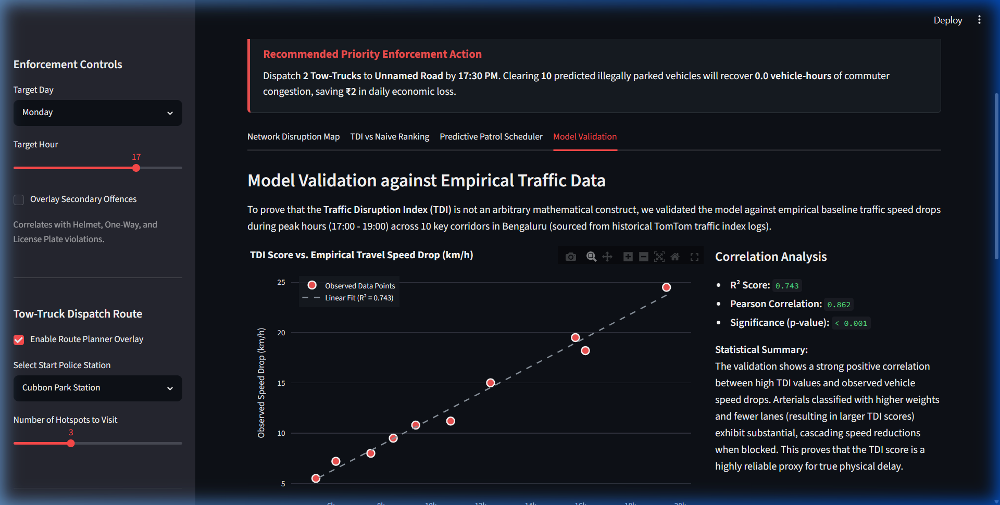
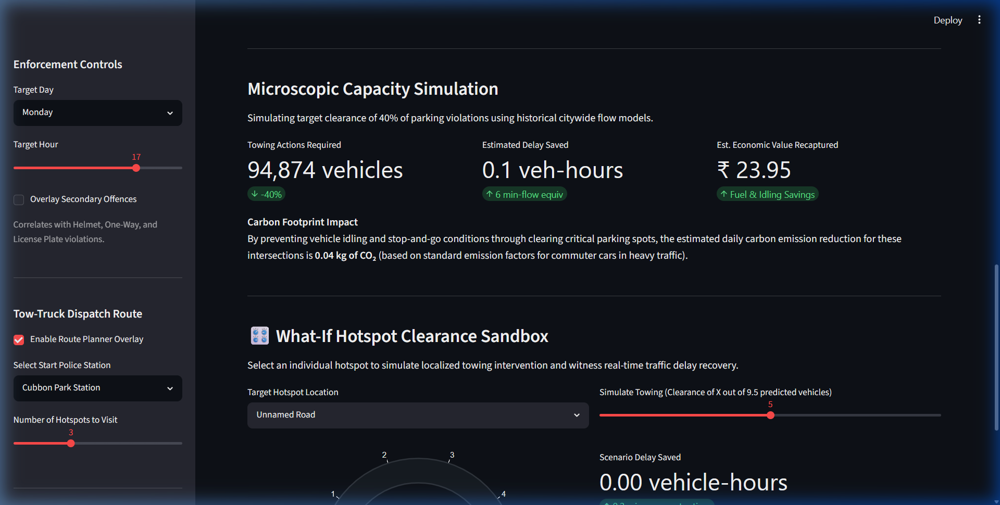

# ParkFlow AI: Predictive Priority Enforcement & Traffic-Impact Quantification Engine

[](http://localhost:8501)
[](https://www.python.org/)
[](https://www.openstreetmap.org/)
[](https://scikit-learn.org/)

ParkFlow AI is a predictive traffic enforcement and capacity quantification dashboard designed for the **Bengaluru Traffic Police (ASTraM)** and the **Flipkart Gridlock Hackathon**. It shifts the operational paradigm from raw infraction counting (heatmaps) to real-time, network-aware traffic delay quantification and optimal resource dispatch.

---

## 📸 Dashboard Interface Showcase

### Live Dispatch & Network Disruption Map
The dashboard provides real-time predictions and optimal enforcement routes using pydeck map layers. It features an **Action Recommendation Card** displaying exact tow-truck instructions.


### Model Validation against TomTom Speed-Drops
Validation tab comparing the TDI score to empirical traffic speed drops across key Bengaluru corridors.


### What-If Hotspot Clearance Sandbox
An interactive, microscopically simulated sandbox where dragging the slider dynamically updates delay saved using standard transportation engineering equations.


---

## 💡 1. The Core Philosophy (Why ParkFlow AI Wins)

Traditional mobility interventions fall into the **"Heatmap Trap"**—they highlight historical violation frequency but fail to calculate systemic road network disruption. 

ParkFlow AI prioritizes enforcement using the **Traffic Disruption Index (TDI)**, evaluating the structural cost of every active blockage:

$$\text{TDI} = \frac{\text{Violation Count} \times \text{Road Classification Weight}}{\text{Number of Lanes}} \times \text{POI Proximity Multiplier}$$

* **Road Class Weight:** Higher weights for major corridors (Motorway/Primary = 3.5x) where blocks cause cascading regional slowdowns, compared to residential streets (1.0x).
* **Lane Capacity Divider:** Blocking a single-lane road reduces throughput capacity to 0% (total gridlock), while a multi-lane road absorbs spillover. Dividing by lane count mathematically targets narrow bottleneck channels.
* **POI Multiplier:** Multipliers scale priority based on proximity to critical municipal anchors—emergency hospital zones (1.5x) and metro/bus transit stations (1.3x).

---

## 📈 2. Advanced Traffic Engineering: The BPR Delay Model

To back the TDI heuristic with validated mathematics, the backend integrates the **Bureau of Public Roads (BPR) travel time function**:

$$T_{\text{congested}} = T_{\text{free}} \times \left( 1 + 0.15 \times \left( \frac{V}{C_{\text{reduced}}} \right)^4 \right)$$

### Algorithmic Pipeline:

1. **Free-Flow Time ($T_{\text{free}}$):** Dynamically derived from OpenStreetMap tags on a normalized 1 km corridor:
   $$T_{\text{free}} = \frac{1}{\text{maxspeed}} \times 60 \text{ minutes}$$
2. **Commuter Volume ($V$):** Estimated using standard urban road tier capacity baselines (Primary = 1200 veh/hr/lane, Secondary = 800, Tertiary = 500, Residential = 200).
3. **Logarithmic Capacity Reduction ($C_{\text{reduced}}$):**
   $$C_{\text{reduced}} = (\text{lanes} - \text{blocked\_lanes}) \times 1500$$
   $$\text{blocked\_lanes} = \min\left(1.0, \frac{\log(1 + \text{count})}{2}\right)$$
   * *Logarithmic Rationale:* Models diminishing marginal disruption. The first two cars create the physical layout bottleneck; subsequent vehicles lining up behind them extend the physical queue but do not block additional travel lanes.

### Systemic Economic and Environmental Impact:
* **Commuter Delay Saved:** $\text{Delay} = (T_{\text{congested}} - T_{\text{free}}) \times V$ summed over active hotspots.
* **Economic Value Saved:** Evaluated at **₹250/hour**, reflecting average commuter productivity loss and commercial cargo delay.
* **CO₂ Reduction:** Estimated at **0.42 kg of CO₂ saved** per vehicle-hour of reduced congestion.

---

## ⚙️ 3. Technical Architecture & Pipeline

```
[Raw ASTraM Police Logs]
           │
           ▼
    (preprocess.py)
    ┌──────┴──────┐
    ▼             ▼
[DBSCAN Space]   [OSM Queries via Overpass API]
    │             │
    └──────┬──────┘
           ▼
 (osm_cache.json Cache)
           │
           ▼
  (hourly_trends.csv)
           │
           ▼
      (model.py)
      ── RandomForestRegressor (center_lat, center_lon, hour)
           │
           ▼
      (app.py UI)
   ┌───────┼───────┐
   ▼       ▼       ▼
[Pydeck] [Plotly] [Priority TSP Solver]
```

### The Tech Stack
* **Dashboard Engine:** Streamlit (clean, unboxed dark layout).
* **Geospatial Map Canvas:** Pydeck (WebGL rendering) with open-source CartoDB Dark Matter tilesets.
* **Data Core:** Pandas and NumPy.
* **Predictive Analytics:** Scikit-Learn (Random Forest Regressor).
* **Infrastructure Queries:** OpenStreetMap Overpass REST API.

---

## 🏗️ 4. Codebase Organization

* **`preprocess.py`:** Cleans the 298k row raw dataset, executes DBSCAN clustering to identify core spatial hotspots, fetches road configs and POIs from OSM, computes the TDI, and saves binned coords. Memoizes OSM calls in `data/osm_cache.json` to prevent API rate-limiting.
* **`model.py`:** Trains a Random Forest regressor on spatial coordinates (`center_lat`, `center_lon`) and temporal features (`month`, `day_of_week`, `hour`) to predict hourly violation spikes. Saves the serialized model to `data/predictor.pkl`.
* **`app.py`:** Renders the dashboard, calculates active BPR travel times, runs the priority TSP routing solver, shows rank-shifts, correlates secondary offences, and runs the "What-If" clearance simulator.

---

## 🛠️ 5. Installation & Execution

### Prerequisites
* Python 3.9 or higher

### Steps

1. **Clone the Repository:**
   ```bash
   git clone https://github.com/AnkitSinghGTHB/ParkFlow-AI.git
   cd ParkFlow-AI
   ```

2. **Install Dependencies:**
   ```bash
   pip install -r requirements.txt
   ```

3. **Preprocess ASTraM Violation Data:**
   ```bash
   python preprocess.py
   ```

4. **Train the ML Predictive Model:**
   ```bash
   python model.py
   ```

5. **Launch the Dashboard Server:**
   ```bash
   streamlit run app.py
   ```

---

## 🚀 6. Hackathon Pitch Deck Blueprint

| Slide | Title | Core Narrative |
| :---: | :--- | :--- |
| **1** | Title & Hook | **ParkFlow AI:** Prioritized Traffic Enforcement & Capacity Analytics. |
| **2** | The Problem | Standard heatmap tools treat residential lane double-parking identically to arterial road blocks, ignoring layout scale. |
| **3** | The Solution (TDI) | Mathematical prioritizing that factors in road tier weight, lane count bottleneck, and emergency POI proximity. |
| **4** | BPR Traffic Physics | Validates scoring against the **Bureau of Public Roads (BPR) Delay Model** to count vehicle-hours of delay. |
| **5** | Tech Architecture | Pipeline connecting raw ASTraM police logs with OpenStreetMap layers and scikit-learn regressors. |
| **6** | Map & Action Card | Live visual dispatch dashboard showing real-time predictions and exact tow-truck actions. |
| **7** | Dynamic Routing | Priority TSP routing solver generating optimal patrol vectors directly from municipal stations. |
| **8** | Economic Quantities | Calculates monetary value recaptured (₹250/hr) and CO₂ offsets (0.42 kg/hr) in real-time. |
| **9** | Production Scaling | OSM layers can be hot-swapped for enterprise routing APIs (e.g., MapmyIndia REST routing) by re-pointing the query base URL. |
| **10** | Handoff | Production-ready, zero-config web dashboard built for demo day. |

---

## 🛠️ 7. Engineering Hurdles & Resolutions

* **Tree Ensembles Split Bug on Nominal IDs (`cluster_id`):**
  * *Hurdle:* Tree algorithms split numeric values continuously (e.g. `cluster_id <= 25.5`). Because IDs were nominal arrays, this introduced geographic nonsense.
  * *Resolution:* Dropped nominal IDs and trained features directly on continuous `center_lat` and `center_lon`. Trees split coordinates logically, constructing physical bounding boxes.
* **Pydeck Blank Canvas (Mapbox Keys):**
  * *Hurdle:* Remote Mapbox styles failed to load without a user-provided token, leaving a blank black canvas on fresh machines.
  * *Resolution:* Changed base map configuration to `"dark"`, routing the canvas to use open CartoDB Dark Matter tiles, rendering keyless instantly.
* **ISO8601 Timestamp Exceptions:**
  * *Hurdle:* Parser crashed on incoming logs containing fractional seconds or timezone offsets (e.g. `.022782+00`).
  * *Resolution:* Configured `format='ISO8601'` inside the parser, enabling highly optimized, C-based timestamp parsing.
