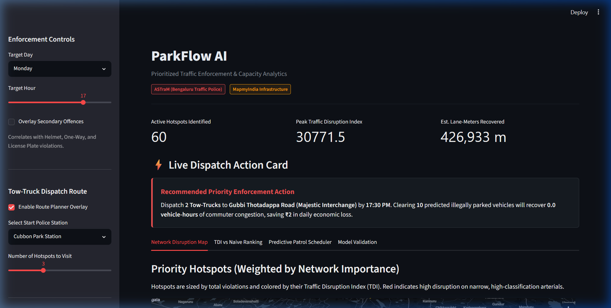

# ParkFlow AI
**Prioritized Parking Enforcement & Congestion Quantification for Bengaluru**

> “Not just *where* violations happen—but how much congestion they cause,  
> how much delay they create, and exactly where to send the tow‑truck.”

[](https://github.com/AnkitSinghGTHB/ParkFlow-AI)
[](LICENSE)

---

## The Problem
Bengaluru Traffic Police issue thousands of parking violation tickets.  
But enforcement is reactive: all violations are treated equally, with no way to
prioritize the ones that actually choke the city’s arteries.

## What ParkFlow AI Does
- 🔥 **Traffic Disruption Index (TDI)** – weights violations by road class, lane count & proximity to hospitals/metro stations.  
- ⏱️ **Quantified Congestion Impact** – uses the Bureau of Public Roads (BPR) function to convert violations into **vehicle‑hours lost**, **₹ economic loss** & **CO₂ emitted**.  
- 🤖 **ML‑powered Hourly Forecasts** – Random Forest predicts violation surges per hotspot for the next hour.  
- 🚛 **Tow‑Truck Route Optimizer** – plans the shortest path from a police station to the most disruptive active hotspots.

**Result:** A one‑click dashboard that tells an enforcement officer **which 3 streets to clear now, how much delay they’ll save, and the exact route to take**.

---

## Live Demo
👉 [**Try it here**](https://github.com/AnkitSinghGTHB/ParkFlow-AI)

### Dashboard Interface Preview


---

## How It Works (30‑second read)

1. **Data In** → Anonymized police violation logs (Jan–May 2024)  
2. **Preprocess** → DBSCAN clusters hotspots, OpenStreetMap enriches with lane/POI data  
3. **Predict** → Random Forest forecasts violation count per hotspot per hour (MAE 6.19)  
4. **Compute Impact** → TDI ranks hotspots; BPR formula calculates delay, ₹, CO₂ for each  
5. **Optimize Route** → Greedy nearest-neighbor route tracing using actual OSRM road geometries  
6. **Visualize** → Streamlit + Pydeck interactive map with live metrics & “clearance scenario” slider

---

<details>
<summary><b>📖 Deep-Dive Engineering & Mathematical Models (Expand to view)</b></summary>

### 1. The Core Philosophy & TDI Score
Most software interventions suffer from the **"Heatmap Trap"** (showing raw frequency). ParkFlow AI prioritizes enforcement using the **Traffic Disruption Index (TDI)** to evaluate the structural cost of blockages:

$$\text{TDI} = \frac{\text{Violation Count} \times \text{Road Classification Weight}}{\text{Number of Lanes}} \times \text{POI Proximity Multiplier}$$

* **Road Class Weight:** Major corridors (Motorway/Primary = 3.5x) receive higher weights than residential side streets (1.0x).
* **Lane Capacity Divider:** Blocking a 1-lane road reduces capacity to 0% (total bottleneck); dividing by lanes mathematically prioritizes narrower channels.
* **POI Multiplier:** Scales priority based on critical anchors—emergency hospital zones (1.5x) and transit hubs (1.3x).

---

### 2. Advanced Traffic Engineering: The BPR Delay Model
The backend integrates the industry-standard **Bureau of Public Roads (BPR) travel time function**:

$$T_{\text{congested}} = T_{\text{free}} \times \left( 1 + 0.15 \times \left( \frac{V}{C_{\text{reduced}}} \right)^4 \right)$$

1. **Free-Flow Time ($T_{\text{free}}$):** Derived from OSM segment speed limits: $T_{\text{free}} = \frac{1}{\text{maxspeed}} \times 60$ minutes.
2. **Traffic Volume ($V$):** Modeled based on urban road tier baselines (Primary = 1200 veh/hr/lane, Secondary = 800, Tertiary = 500, Residential = 200).
3. **Logarithmic Capacity Reduction ($C_{\text{reduced}}$):**
   $$C_{\text{reduced}} = (\text{lanes} - \text{blocked\_lanes}) \times 1500$$
   $$\text{blocked\_lanes} = \min\left(1.0, \frac{\log(1 + \text{count})}{2}\right)$$
   *Logarithmic Rationale:* Diminishing marginal disruption. The first two cars create the bottleneck layout; subsequent vehicles line up behind and extend the queue, but do not block additional travel lanes.

#### Macroeconomic & Emission Quantifications
* **Commuter Delay Saved:** $(T_{\text{congested}} - T_{\text{free}}) \times V$ in vehicle-hours.
* **Economic Value Saved:** Evaluated at **₹250/hour**, representing productivity loss and cargo delay.
* **CO₂ Offset:** **0.42 kg of CO₂ saved** per vehicle-hour of reduced congestion.

---

### 🔍 Spatial Data Analysis Note: The 61,543 Violation Top Hotspot
* **Finding:** The top hotspot (Hospital Road) contains 61,543 violations (over 20% of the dataset).
* **Data-Collection Artifact:** Many citation systems log coordinates using a fixed junction reference point (or closest police station reference) rather than precise GPS coordinates. When binning to 4 decimal places (50m precision), thousands of historical records collapse into a single junction coordinate.
* **Enforcement Handling:** ParkFlow AI's congestion engine prevents this spike from overwhelming resource planning by using a logarithmic capacity reduction formula ($C_{\text{reduced}}$) in the BPR model. This ensures that the tow-truck routing solver remains geographically balanced instead of getting trapped at a single junction.

---

### 🚀 Hackathon Pitch Deck Blueprint

| Slide | Title | Core Narrative |
| :---: | :--- | :--- |
| **1** | Title & Hook | **ParkFlow AI:** Prioritized Parking Enforcement & Traffic-Impact Quantification. |
| **2** | The Problem | Heatmaps treat residential lane double-parking identically to arterial highway blocks, ignoring layout scale. |
| **3** | The Solution (TDI) | Mathematical prioritizing that factors in road tier weight, lane count bottleneck, and emergency POI proximity. |
| **4** | BPR Traffic Physics | Fuses BPR travel time equations to convert raw infractions into vehicle-hours lost. |
| **5** | Tech Architecture | Fuses raw ASTraM police logs with OpenStreetMap layers and scikit-learn regressors. |
| **6** | Map & Action Card | Live visual dispatch dashboard showing real-time predictions and exact tow-truck actions. |
| **7** | Dynamic Routing | Priority TSP routing solver generating optimal patrol vectors directly from municipal stations. |
| **8** | Economic Quantities | Calculates monetary value recaptured (₹250/hr) and CO₂ offsets (0.42 kg/hr) in real-time. |
| **9** | Production Scaling | OSM layers can be hot-swapped for enterprise routing APIs (e.g., MapmyIndia REST routing). |
| **10** | Handoff | Production-ready, zero-config web dashboard built for demo day. |

---

### 🛠️ Key Engineering Resolutions
* **The `cluster_id` Tree Bug:** Tree algorithms split numeric values continuously (e.g., `cluster_id <= 25.5`). We dropped nominal IDs and trained features directly on continuous `center_lat` and `center_lon` to build logical geographic bounding boxes.
* **DateTime Format Variance:** Configured `format='ISO8601'` inside the Pandas I/O parser, enabling highly optimized, C-based timestamp parsing.
* **Blank Map Canvas (Mapbox Keys):** Rerouted Pydeck styles to use the open-source CartoDB Dark Matter tileset, enabling zero-config keyless rendering instantly.
* **Pydeck Tooltip Formatting Bug:** Pre-formatted float variables into clean strings inside the Python backend to resolve Deck.gl JS template parsing constraints.
* **OSM API Query Overloads:** Patched `preprocess.py` to use a custom User-Agent, increased network timeouts to 20 seconds, implemented rate-limit retries, and added unbuffered logging with a 0.3s sleep interval to prevent Overpass blocks.

</details>

---

## Tech Stack
- **UI:** Streamlit, Pydeck, Plotly  
- **ML:** Scikit‑learn (Random Forest)  
- **Spatial:** DBSCAN, OpenStreetMap Overpass API  
- **Traffic Engineering:** Bureau of Public Roads (BPR) function  
- **Routing:** FOSSGIS OSRM Routing Service

---

## Quick Start

1. **Clone the repo**
   ```bash
   git clone https://github.com/AnkitSinghGTHB/ParkFlow-AI.git
   cd ParkFlow-AI
   ```

2. **Install dependencies**
   ```bash
   pip install -r requirements.txt
   ```

3. **Add the dataset**
   - Download the provided `jan_to_may_violations.csv`
   - Place it inside the `data/` folder.

4. **Pre‑process & train (one‑time)**
   ```bash
   python preprocess.py
   python model.py
   ```

5. **Launch the dashboard**
   ```bash
   streamlit run app.py
   ```
   Open `http://localhost:8501` in your browser.

---

## Repository Structure
```
.
├── app.py                # Streamlit dashboard, BPR impact formulas, & OSRM routing
├── preprocess.py         # Data cleaning, DBSCAN clustering, & OSM enrichment
├── model.py              # ML training (Random Forest Regressor)
├── data/
│   ├── (violations CSV)  # Place dataset here (ignored by git to stay under 50MB upload limit)
│   ├── osm_cache.json    # Cached OSM queries (prevents rate limits)
│   ├── parking_hotspots.csv  # Preprocessed cluster centers
│   └── hourly_trends.csv     # Historical hourly violation metrics
├── screenshots/          # High-resolution screenshots of the dashboard interface
├── requirements.txt      # Project dependencies
└── README.md             # This landing page
```

---

## Credits
Built for Flipkart Gridlock 2.0 Round 2 – Theme: *Poor Visibility on Parking‑Induced Congestion*.  
Dataset provided by Bengaluru Traffic Police (ASTraM).

[Demo Video](screenshots/interaction_demo.webp)
